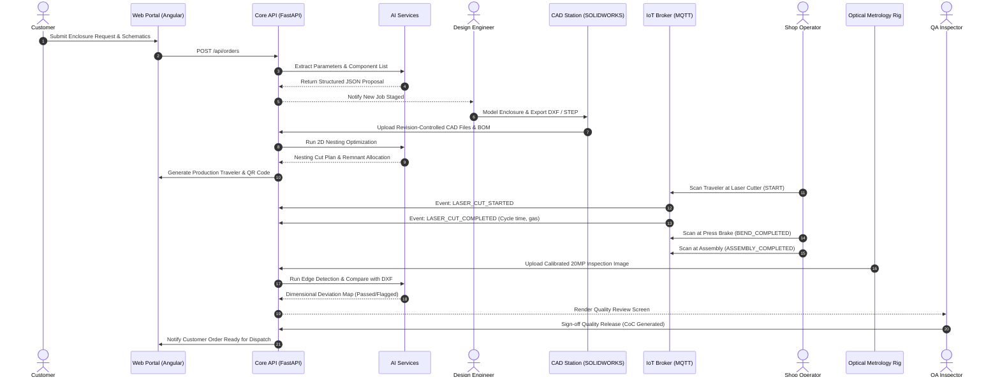

# End-to-End System Data Flow Pipeline

This document traces the complete data lifecycle of a fabrication order through the AIoT platform.

```mermaid
sequenceDiagram
    autonumber
    actor Customer
    participant WebApp as Web Portal (Angular)
    participant Backend as Core API (FastAPI)
    participant AI as AI Services
    actor Engineer as Design Engineer
    participant CAD as CAD Station (SOLIDWORKS)
    participant IoT as IoT Broker (MQTT)
    actor Operator as Shop Operator
    participant Vision as Optical Metrology Rig
    actor Inspector as QA Inspector

    Customer->>WebApp: Submit Enclosure Request & Schematics
    WebApp->>Backend: POST /api/orders
    Backend->>AI: Extract Parameters & Component List
    AI-->>Backend: Return Structured JSON Proposal
    Backend-->>Engineer: Notify New Job Staged
    Engineer->>CAD: Model Enclosure & Export DXF / STEP
    CAD->>Backend: Upload Revision-Controlled CAD Files & BOM
    Backend->>AI: Run 2D Nesting Optimization
    AI-->>Backend: Nesting Cut Plan & Remnant Allocation
    Backend->>WebApp: Generate Production Traveler & QR Code
    
    Operator->>IoT: Scan Traveler at Laser Cutter (START)
    IoT->>Backend: Event: LASER_CUT_STARTED
    IoT->>Backend: Event: LASER_CUT_COMPLETED (Cycle time, gas)
    Operator->>IoT: Scan at Press Brake (BEND_COMPLETED)
    Operator->>IoT: Scan at Assembly (ASSEMBLY_COMPLETED)
    
    Vision->>Backend: Upload Calibrated 20MP Inspection Image
    Backend->>AI: Run Edge Detection & Compare with DXF
    AI-->>Backend: Dimensional Deviation Map (Passed/Flagged)
    Backend-->>Inspector: Render Quality Review Screen
    Inspector->>Backend: Sign-off Quality Release (CoC Generated)
    Backend->>WebApp: Notify Customer Order Ready for Dispatch
```
